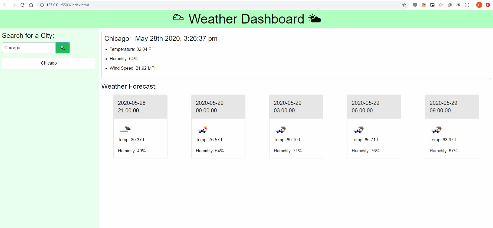

# 06 Server-Side APIs: Weather Dashboard

This web application gives current and forecasted weather via searched city

It also saves the previously searched city and allows the user to click on that city to display the current and future weather.

This uses openweathermap api and momentjs api.

This allows the user to find the current and forecasted weather in any city.

## Site Image

## Deployed Site

https://brockbatblue.github.io/Weather_Dashboard/
